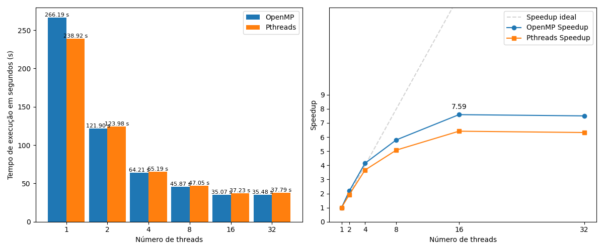
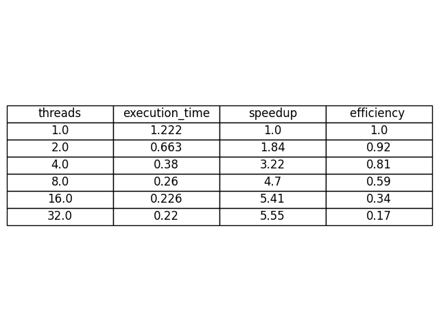

# Análise do desempenho da execução do Conway's Game of Life implementado em C com as bibliotecas Pthreads e OpenMP

Esse código combina a execução do jogo da vida de Conway em C com uma análise de dados em Python para exemplificar os conceitos de speedup e eficiência na programação concorrente.

## Sumário

- [Uso](#uso)
- [Instalação](#instalação-de-bibliotecas)
- [Geração de Dados de Desempenho](#geração-de-dados-de-desempenho)
- [Análise de Dados de Desempenho](#análise-de-dados-de-desempenho)
- [Informações Adicionais](#informações-adicionais)
- [Análise](#análise)


## Uso

Esta codigo é composto por cinco componentes principais:

1. **generate_data.py**: Gera dados de desempenho para OpenMP e Pthreads executando um programa com diferentes números de threads e salva os dados em um arquivo CSV.

2. **analyze_data.py**: Analisa os dados de desempenho, criando gráficos de barras, gráficos de speedup e tabelas de desempenho. Os resultados são salvos como imagens e arquivos CSV.

3. **main.py**: O script principal que coordena a geração e análise dos dados de desempenho. Você pode executar este script para automatizar o processo.

4. **gameOfLife com pthreads**: O conjunto de códigos que gera o executável para rodar o jogo da vida com Pthreads.

5. **gameOfLife com openMP**: O conjunto de códigos que gera o executável para rodar o jogo da vida com OpenMP.

### Instalação de bibliotecas

Antes de executar o arquivo **main.py**, você deve ter o [Python](https://www.python.org/downloads/) instalado em seu sistema.

Além disso as bibliotecas no arquivo [requirements.txt](./requirements.txt) devem ser instaladas.

Compile os programas em C.
Para compilar o arquivo em pthreads execute no diretório './src/c/pthreads'

```
gcc main.c gameoflife.c -o main
```

Para compilar o arquivo em OpenMP execute no diretório './src/c/openmp'

```
gcc -0 main main.c gameoflife.c -fopenmp
```

### Execução dos programas e obtenção dos dados de performance

Execute o seguinte comando para gerar dados de desempenho:

```
python main.py
```
Este comando executará os programas com várias contagens de threads e salvará os resultados em um arquivo CSV.

Se você deseja regerar os dados e substituir o arquivo CSV existente, pode usar a flag force:

```
python main.py force
```

### Análise de Dados de Desempenho
Para analisar os dados de desempenho e gerar visualizações, execute o seguinte comando:

```
python main.py
```

Este comando criará gráficos de barras comparando OpenMP e Pthreads, gráficos de speedup e tabelas de desempenho. Os resultados serão salvos no diretório '../../data/images/'

### Informações Adicionais
Você pode personalizar o número de threads e gerações no script generate_data.py.

A ferramenta pressupõe que você tenha dois programas C, um usando OpenMP e outro usando Pthreads, para medição de desempenho. Certifique-se de que os caminhos para esses programas estejam corretamente especificados no script generate_data.py.

As tabelas de desempenho geradas são salvas como arquivos CSV no diretório ../../data/csv/.

## Análise

Nota-se que quanto maior o número de threads, em média, menor é o tempo de execução. Observamos esse fenômeno no gráfico da direita, que exibe o speedup dos programas escritos com o OpenMP e o Pthreads. Temos, porém, que a partir de 8 threads a taxa de variação do speedup diminui consideravelmente, indicando que a partir desse ponto o paralelismo não trás ganho significante de eficiência.

Isso se deve ao fato do processador utilizado ter 12 cores, implicando que o paralelismo em tempo real máximo é com 12 threads.


A tabela abaixo mostra uma tabela com a quantidade de threads, o tempo de execução do programa, o speedup e a eficiência para cada um dos casos.


